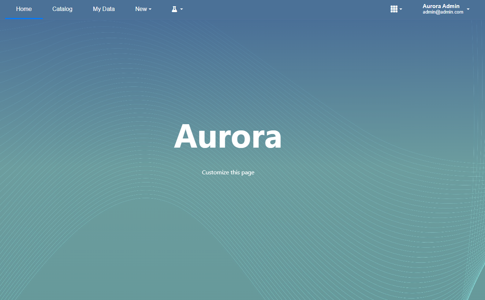
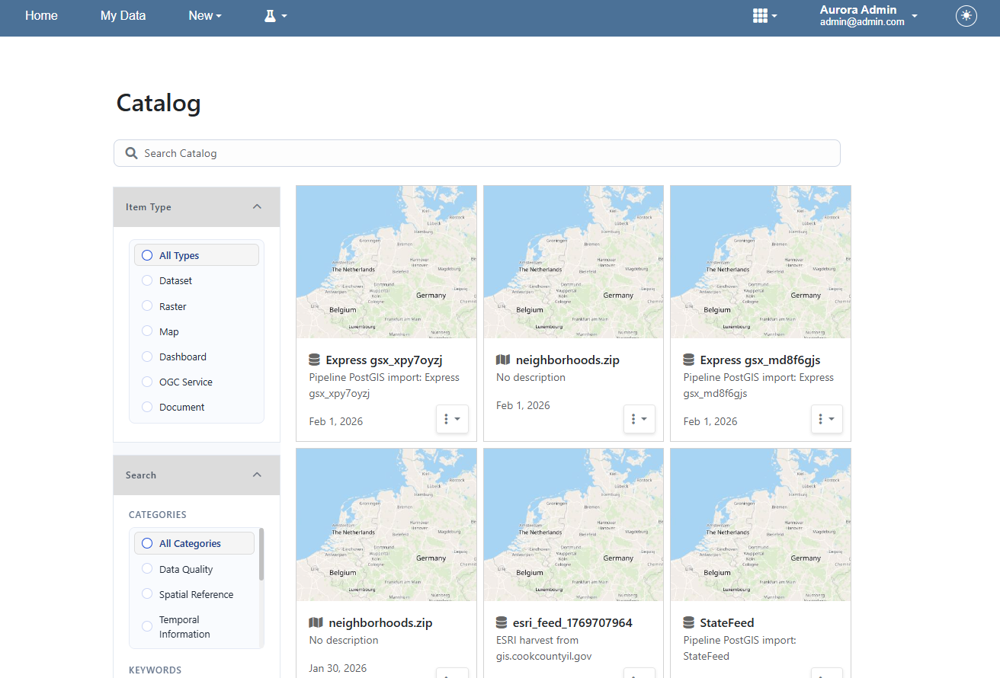
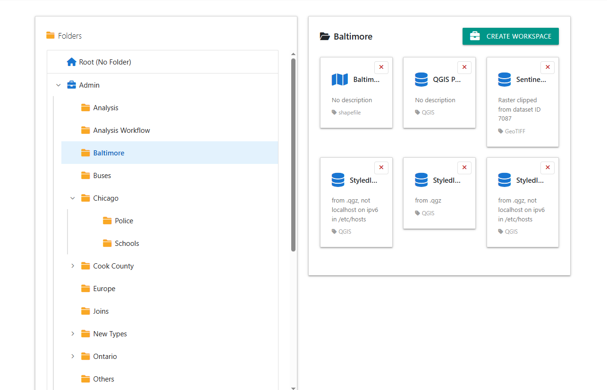

Layout
==================

Selection
----------------------

Aurora offers three layout/homepage options.

1. Default.  

This style can be used to host custom content on your homepage.

2. Portal. 

This style is for Public and/or Private Portals.

   

3. Browser.  
   
This style is geared towards internal use within an organization.

Getting Started Page
----------------------

The **Getting Started** page contains sequential tutorials for loading data and other components.

.. image:: _static/webapp-2.png

.. image:: _static/spacer.png

Docs Page
----------------------

The **Docs** page contains the full documentation.

.. image:: _static/webapp-3.png
.. image:: _static/spacer.png

Remove or Replace

You can remove the Welcome app, or replace it with your content by removing the contents of /var/www/html::

    rm -rf /var/www/html/*
